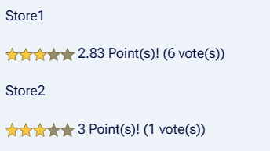
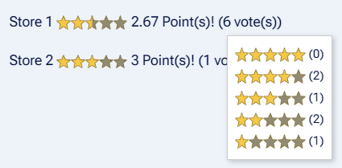
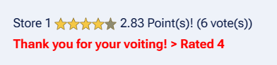

# StarRating — MediaWiki Extension





**Star Rating** displays a five-star rating widget within a MediaWiki page,  
allowing users to visually rate content with stars—just like "Five stars!".

## ✨ Features

- Aggregates rating votes from multiple users,  
  and displays the average score and distribution.

- Stores screen context, tag `id` attributes, and per-user rating data in the database.  
  

- Supports placing multiple rating widgets on a single page.

## ❓ QA

### Q. Aren't there other similar add-ins available?

**A.**  
I created this add-in because the existing ones didn’t allow me to do what I wanted.

For example, imagine a Wiki for a game.

You wouldn’t just ask, “What’s the rating for this game?”

You’d want to rate multiple aspects like:

- How fun is it?
- How are the graphics?
- How original is it?
- How is the music?

In such cases, you’d want to place multiple 5-star ratings on a single page.

This add-in was created to make that possible.

### Q. What if a malicious user tries to vote multiple times?

**A.**  
First, you can configure via parameters whether to allow only logged-in users to vote, or allow all users.

Also, each user can vote only once per item.

Repeated votes will simply update the previous rating.

For users who are not logged in, their IP address is used for identification, and only one vote per item is accepted.


## 📦 Installation

1. **Download the extension**  
   You can download the entire extension as a ZIP file from the GitHub Releases page:  
   or click the green **Code** button on the repository page and choose **Download ZIP**.

2. Extract the contents into your `extensions/` directory:

   extensions/
   └── StarRating/

3. Add the following to your LocalSettings.php:

   wfLoadExtension( 'StarRating' );

Tested with MediaWiki 1.44.

## 🧩 Usage

To display the rating feature provided by this extension,  
insert the following tag into the desired page:

```html
<StarRating id="id_name">
```

## 💾 Database Storage Specification

User-submitted rating results are stored in the database table `star_rating`  
with the following structure:

- Page ID (`page_id`)  
- Tag ID (`tag_id`)  
- User ID (`user_id`)  
- Rating score (`rating`)

## ⚙️ Tag Parameters

The following parameters can be specified:

- **`id`**  
  Required. Used as the identifier for the tag.

- **`digit`**  
  Number of decimal places shown in the rating score.  
  Range: `0` to `4` (Default: `1`)

- **`star_size`**  
  Size of the displayed stars.  
  Default: `16px`

- **`clear_cache`**  
  Clears the page cache when rendering the tag.  
  Default: `false`

  - If `true`:  
    Vote data from the database is immediately reflected on the screen,  
    but page rendering may become slower.
  - If `false`:  
    Data is reflected periodically.

- **`allow_anonymous`**  
  Allows non-logged-in users to vote.  
  Default: `false`

```html
Store 1<br/>
<StarRating id="store1" digit="2" star_size="20" clear_cache="true">
Store 2<br/>
<StarRating id="store2" digit="2" star_size="20">
```
  

## 📜 License

This extension is released under the GNU General Public License v2 or later:  
https://www.gnu.org/licenses/old-licenses/gpl-2.0.html

## 🤝 Contributing

Bug reports, feature requests, and pull requests are welcome.  
Feel free to fork and improve!

## Status Update

As a summer homework-style challenge, this project was created in just three days with heavy reliance on AI.

The theme of the assignment was: “Fully leveraging AI to build a working program.”

Approximately 70–80% of the code was generated by AI.

As a result, variable naming conventions and other styles may be inconsistent.

I had zero prior knowledge of PHP.

I also had very little understanding of the MediaWiki system.

## Support This Project

Even a small contribution would mean a lot — no amount is too little.  
Think of it like giving a "like" or a thumbs-up!

Your support helps boost motivation for ongoing improvements and maintenance.  
Thank you!

👉 [Buy Me a Coffee](https://buymeacoffee.com/hercle)

