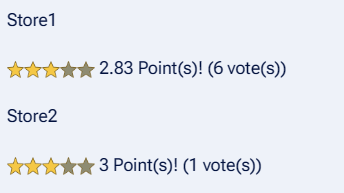
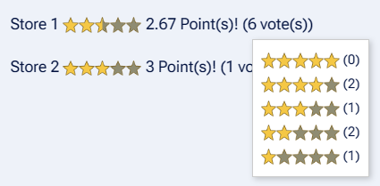

# StarRating — MediaWiki Extension





**Star Rating** displays a five-star rating widget within a MediaWiki page,  
allowing users to visually rate content with stars—just like "Five stars!".

## ✨ Features

- Aggregates rating votes from multiple users,  
  and displays the average score and distribution.

- Stores screen context, tag `id` attributes, and per-user rating data in the database.  
  

- Supports placing multiple rating widgets on a single page.

## 📦 Installation

1. **Download the extension**  
   You can download the entire extension as a ZIP file from the GitHub Releases page:  
   or click the green **Code** button on the repository page and choose **Download ZIP**.

2. Extract the contents into your `extensions/` directory:

   extensions/
   └── StarRating/

3. Add the following to your LocalSettings.php:

   wfLoadExtension( 'StarRating' );

Tested with MediaWiki 1.44.

## 🧩 Usage

To display the rating feature provided by this extension,  
insert the following tag into the desired page:

```html
<StarRating id="id_name">
```

## 💾 Database Storage Specification

User-submitted rating results are stored in the database table `star_rating`  
with the following structure:

- Page ID (`page_id`)  
- Tag ID (`tag_id`)  
- User ID (`user_id`)  
- Rating score (`rating`)

## ⚙️ Tag Parameters

The following parameters can be specified:

- **`id`**  
  Required. Used as the identifier for the tag.

- **`digit`**  
  Number of decimal places shown in the rating score.  
  Range: `0` to `4` (Default: `1`)

- **`star_size`**  
  Size of the displayed stars.  
  Default: `16px`

- **`clear_cache`**  
  Clears the page cache when rendering the tag.  
  Default: `false`

  - If `true`:  
    Vote data from the database is immediately reflected on the screen,  
    but page rendering may become slower.
  - If `false`:  
    Data is reflected periodically.

```html
Store 1<br/>
<StarRating id="store1" digit="2" star_size="20" clear_cache="true">
Store 2<br/>
<StarRating id="store2" digit="2" star_size="20">
```
  

## 📜 License

This extension is released under the GNU General Public License v2 or later:  
https://www.gnu.org/licenses/old-licenses/gpl-2.0.html

## 🤝 Contributing

Bug reports, feature requests, and pull requests are welcome.  
Feel free to fork and improve!

## Status Update

As a summer homework-style challenge, this project was created in just three days with heavy reliance on AI.

The theme of the assignment was: “Fully leveraging AI to build a working program.”

Approximately 70–80% of the code was generated by AI.

As a result, variable naming conventions and other styles may be inconsistent.

I had zero prior knowledge of PHP.

I also had very little understanding of the MediaWiki system.
